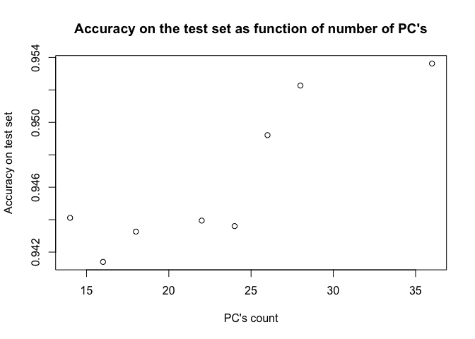

Acnowledgements
---------------

Ugulino, W.; Cardador, D.; Vega, K.; Velloso, E.; Milidiu, R.; Fuks, H.
Wearable Computing: Accelerometers' Data Classification of Body Postures
and Movements. Proceedings of 21st Brazilian Symposium on Artificial
Intelligence. Advances in Artificial Intelligence - SBIA 2012. In:
Lecture Notes in Computer Science. , pp. 52-61. Curitiba, PR: Springer
Berlin / Heidelberg, 2012. ISBN 978-3-642-34458-9. DOI:
10.1007/978-3-642-34459-6\_6. Cited by 2 (Google Scholar)

Read more: <http://groupware.les.inf.puc-rio.br/har#ixzz4UbtiyO7m>

The goal
--------

One thing that people regularly do is quantify how much of a particular
activity they do, but they rarely quantify how well they do it. In this
project, your goal will be to use data from accelerometers on the belt,
forearm, arm, and dumbell of 6 participants. The goal of the project is
to predict the manner in which they did the exercise. This is the
"classe" variable in the training set.

Download data:
--------------

    destfile1 = "pml-training.csv"
    if(!file.exists(destfile1)){
      download.file("https://d396qusza40orc.cloudfront.net/predmachlearn/pml-training.csv",destfile = destfile1)
    }
    destfile2 = "pml-training.csv"
    if(!file.exists(destfile2)){
      download.file("https://d396qusza40orc.cloudfront.net/predmachlearn/pml-testing.csv",destfile = destfile2)
    }
    labeled_data <- read.csv2("pml-training.csv",header = TRUE, na.strings = "NA", sep = ",", quote = "\"",dec = ".")
    quiz_data <- read.csv2("pml-testing.csv",header = TRUE, na.strings = "NA", sep = ",", quote = "\"",dec = ".")
    lbl_numbs <- sapply(labeled_data, is.numeric)
    quz_numbs <- sapply(quiz_data,is.numeric)
    dim(labeled_data)

    ## [1] 19622   160

    dim(quiz_data)

    ## [1]  20 160

    table(labeled_data$classe, labeled_data$user_name)

    ##    
    ##     adelmo carlitos charles eurico jeremy pedro
    ##   A   1165      834     899    865   1177   640
    ##   B    776      690     745    592    489   505
    ##   C    750      493     539    489    652   499
    ##   D    515      486     642    582    522   469
    ##   E    686      609     711    542    562   497

    table(quiz_data$user_name)

    ## 
    ##   adelmo carlitos  charles   eurico   jeremy    pedro 
    ##        1        3        1        4        8        3

Training, test and validation data
----------------------------------

There is a lot of data. We'll split labeled data into 3 subsets: 40% -
training data, 30% - test data and 30% - validation data

    inTrain <- createDataPartition(y=labeled_data$classe, p = 0.4, list=FALSE)
    train_data <- labeled_data[inTrain,]
    test_data <- labeled_data[-inTrain,]

    inTest <- createDataPartition(y=test_data$classe, p=0.5, list = FALSE)
    valid_data <- test_data[-inTest,]
    test_data <- test_data[inTest,]

    table(train_data$classe, train_data$user_name)

    ##    
    ##     adelmo carlitos charles eurico jeremy pedro
    ##   A    486      331     351    362    463   239
    ##   B    303      278     295    222    218   203
    ##   C    298      188     212    207    267   197
    ##   D    196      201     257    230    220   183
    ##   E    283      240     288    210    212   210

    table(test_data$classe, test_data$user_name)

    ##    
    ##     adelmo carlitos charles eurico jeremy pedro
    ##   A    331      247     260    262    372   202
    ##   B    245      195     230    203    127   139
    ##   C    230      146     168    142    192   149
    ##   D    153      144     194    179    149   146
    ##   E    212      185     217    156    165   147

    table(valid_data$classe, valid_data$user_name)

    ##    
    ##     adelmo carlitos charles eurico jeremy pedro
    ##   A    348      256     288    241    342   199
    ##   B    228      217     220    167    144   163
    ##   C    222      159     159    140    193   153
    ##   D    166      141     191    173    153   140
    ##   E    191      184     206    176    185   140

Variables
---------

We are going to use 36 numeric mesurements with "gyros", "accel" and
"magnet" prefixes for different points on the athlet body. Preprocessed
using PCA to make an extract of information about athlet movements.

    gyros_columns <- c("gyros_belt_x", "gyros_belt_y" , "gyros_belt_z", 
                       "gyros_arm_x","gyros_arm_y","gyros_arm_z",
                       "gyros_dumbbell_x","gyros_dumbbell_y","gyros_dumbbell_z",
                       "gyros_forearm_x", "gyros_forearm_y", "gyros_forearm_z")
    accel_columns <- c("accel_belt_x", "accel_belt_y" , "accel_belt_z", 
                       "accel_arm_x","accel_arm_y","accel_arm_z",
                       "accel_dumbbell_x","accel_dumbbell_y","accel_dumbbell_z",
                       "accel_forearm_x", "accel_forearm_y", "accel_forearm_z")
    magnet_columns <- c("magnet_belt_x", "magnet_belt_y" , "magnet_belt_z",
                        "magnet_arm_x","magnet_arm_y","magnet_arm_z",
                        "magnet_dumbbell_x","magnet_dumbbell_y","magnet_dumbbell_z", 
                        "magnet_forearm_x", "magnet_forearm_y", "magnet_forearm_z")
    choosen_columns<- c(gyros_columns,accel_columns, magnet_columns)

    num_prcomp <- prcomp(train_data[,choosen_columns])

    eig.val <- get_eigenvalue(num_prcomp)

    plot(eig.val$cumulative.variance.percent, type= "line", xlab="Number of PC", ylab = "Cumulative variance percent", main = "How many principal components are informaative?")

    ## Warning in plot.xy(xy, type, ...): plot type 'line' will be truncated to
    ## first character

    abline(h=95, col="blue")
    abline(h=99,col = "red")

Let's look at PC's variances too:

    fviz_screeplot(num_prcomp, ncp=36)

### Prepare quiz, training, test and validation data in terms of PC's:

    train_PC <- predict(num_prcomp, newdata = train_data[,choosen_columns])
    train_PC<-cbind(data.frame(train_PC), classe = as.factor(train_data$classe))
    test_PC <- predict(num_prcomp, newdata = test_data[,choosen_columns])
    test_PC<-cbind(data.frame(test_PC), classe = as.factor( test_data$classe))
    valid_PC <- predict(num_prcomp, newdata = valid_data[,choosen_columns])
    valid_PC<-cbind(data.frame(valid_PC), classe = as.factor(valid_data$classe))
    quiz_PC <- predict(num_prcomp, newdata = quiz_data[,choosen_columns])
    quiz_PC <- data.frame(quiz_PC)

How we build the model
----------------------

We are going to make our predictions using random forests, for 14, 16,
18, 22, 24, 26,28, 36 PC's.

    #fit random forests for different sets of PC's
    fit_14 <- randomForest(train_PC$classe ~ PC1+PC2+PC3+PC4+PC5+PC6+PC7+PC8+PC9+PC10+PC11+PC12+PC13+PC14, type="classification",data = train_PC)
    fit_16 <- randomForest(train_PC$classe ~ PC1+PC2+PC3+PC4+PC5+PC6+PC7+PC8+PC9+PC10+PC11+PC12+PC13+PC14+PC15+PC16, type="classification",data = train_PC)
    fit_18 <- randomForest(train_PC$classe ~ PC1+PC2+PC3+PC4+PC5+PC6+PC7+PC8+PC9+PC10+PC11+PC12+PC13+PC14+PC15+PC16+PC17+PC18, type="classification",data = train_PC)
    fit_22 <- randomForest(train_PC$classe ~ PC1+PC2+PC3+PC4+PC5+PC6+PC7+PC8+PC9+PC10+PC11+PC12+PC13+PC14+PC15+PC16+PC17+PC18+PC19+PC20+PC21+PC22, type="classification",data = train_PC)
    fit_24 <- randomForest(train_PC$classe ~ PC1+PC2+PC3+PC4+PC5+PC6+PC7+PC8+PC9+PC10+PC11+PC12+PC13+PC14+PC15+PC16+PC17+PC18+PC19+PC20+PC21+PC22+PC23+PC24, type="classification",data = train_PC)
    fit_26 <- randomForest(train_PC$classe ~ PC1+PC2+PC3+PC4+PC5+PC6+PC7+PC8+PC9+PC10+PC11+PC12+PC13+PC14+PC15+PC16+PC17+PC18+PC19+PC20+PC21+PC22+PC23+PC24+PC25+PC26, type="classification",data = train_PC)
    fit_28 <- randomForest(train_PC$classe ~ PC1+PC2+PC3+PC4+PC5+PC6+PC7+PC8+PC9+PC10+PC11+PC12+PC13+PC14+PC15+PC16+PC17+PC18+PC19+PC20+PC21+PC22+PC23+PC24+PC25+PC26+PC27+PC28, type="classification",data = train_PC)
    fit_36 <- randomForest(train_PC$classe ~ ., type="classification",data = train_PC)
    #estimate classes for test sample
    test_class_14 <- predict(fit_14, test_PC)
    test_class_16 <- predict(fit_16, test_PC)
    test_class_18 <- predict(fit_18, test_PC)
    test_class_22 <- predict(fit_22, test_PC)
    test_class_24 <- predict(fit_24, test_PC)
    test_class_26 <- predict(fit_26, test_PC)
    test_class_28 <- predict(fit_28, test_PC)
    test_class_36 <- predict(fit_36, test_PC)
    #estimate test accuracy
    lng <- length(test_PC$classe)
    test_Acc <- data.frame(PC_count=c(14,16,18,22,24,26,28,36), 
                           Test_accuracy= c(sum(test_class_14 == test_PC$classe)/lng,
                                        sum(test_class_16 == test_PC$classe)/lng,
                                       sum(test_class_18 == test_PC$classe)/lng,
                                       sum(test_class_22 == test_PC$classe)/lng,
                                       sum(test_class_24 == test_PC$classe)/lng,
                                      sum(test_class_26 == test_PC$classe)/lng,
                                      sum(test_class_28 == test_PC$classe)/lng,
                                      sum(test_class_36 == test_PC$classe)/lng))

    #output results
    plot(test_Acc$Test_accuracy,x = test_Acc$PC_count, xlab="PC's count", ylab="Accuracy on test set", main = "Accuracy on the test set as function of number of PC's")

    print(test_Acc)

    ##   PC_count Test_accuracy
    ## 1       14     0.9441141
    ## 2       16     0.9413963
    ## 3       18     0.9432648
    ## 4       22     0.9439443
    ## 5       24     0.9436046
    ## 6       26     0.9492101
    ## 7       28     0.9522677
    ## 8       36     0.9536266

The best test error related to random forest created using all PC's. But
results are very similar so may be it is good enough to use only 18
PC's. The best test (out of sample error) is less then train error and
equal to 0.954

Validation (evaluate choosen forest performance)
------------------------------------------------

Missclassification matrix in the table:

    valid_class_36 <- predict(fit_36, valid_PC)
    table(EstimatedValue=valid_class_36,KnownValue=valid_PC$classe)

    ##               KnownValue
    ## EstimatedValue    A    B    C    D    E
    ##              A 1630   58    8   20    3
    ##              B   16 1047   36    3    6
    ##              C   15   28  971   59   17
    ##              D   11    1   11  871   14
    ##              E    2    5    0   11 1042

    valid_accuracy <- sum(valid_class_36 == valid_PC$classe)/length(valid_PC$classe)

Accuracy on validation data is: 0.945

### Quiz data calculations:

    quiz_class_36 <- predict(fit_36, quiz_PC)
    print(quiz_class_36)

    ##  1  2  3  4  5  6  7  8  9 10 11 12 13 14 15 16 17 18 19 20 
    ##  B  A  C  A  A  E  D  B  A  A  B  C  B  A  E  E  A  B  B  B 
    ## Levels: A B C D E

ps The quiz result is 95% too!
